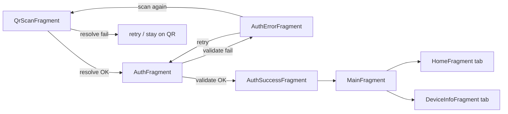

# SecureScan Assignment — Development Roadmap (Android + Kotlin, XML + Fragments)

Each **level** below maps to **one screen/fragment** (or one shared foundation block). Work through them in order unless noted.

---

## Level 0 — Prerequisites — **done**

**Toolkit:** XML layouts, Fragments, single `MainActivity` + **Navigation Component** recommended.

**API summary**

| Method | Path |
|--------|------|
| `POST` | `/qr/resolve` |
| `POST` | `/auth/validate` |
| `GET` | `/demo/qr-tokens` (optional, testing) |
| `GET` | `/health` (optional) |

**Project SDK:** Kotlin 2.0.21 · minSdk **26** · targetSdk **36** · compileSdk **36** · JVM 11.

**Navigation overview**

---

## Level 1 — Backend running locally

| Part | What to do |
|------|------------|
| 1.1 | Run the backend (Dockerfile or local). |
| 1.2 | `GET /health` — verify OK. |
| 1.3 | `GET /demo/qr-tokens` — save tokens for test QR codes. |
| 1.4 | `POST /qr/resolve` and `POST /auth/validate` — capture **exact JSON** for models later. |
| 1.5 | Document **base URL**: emulator `http://10.0.2.2:PORT` vs device **LAN IP**. |

---

## Level 2 — `MainActivity` + navigation shell (no business logic yet)

| Part | What to do |
|------|------------|
| 2.1 | **Dependencies:** Navigation Fragment, Lifecycle ViewModel, Coroutines, Retrofit, Moshi/Kotlinx Serialization, OkHttp, CameraX, ML Kit Barcode (or ZXing). |
| 2.2 | **`MainActivity`**: hosts `NavHostFragment`; theme, edge-to-edge if needed. |
| 2.3 | **`nav_graph.xml`:** destinations for every fragment below (IDs match class names). Start destination = `QrScanFragment`. |
| 2.4 | **Stub fragments:** empty layouts (`TextView` placeholder) + classes so the app builds and you can click through empty screens. |
| 2.5 | **Manifest:** `INTERNET`, `CAMERA`, `uses-feature` camera (optional), `networkSecurityConfig` placeholder for dev HTTP if needed. |

---

## Level 3 — Data models + API (shared by all screens)

| Part | What to do |
|------|------------|
| 3.1 | Parse **QR string** into config: **base URL** + **client identity** (match backend contract from Level 1). |
| 3.2 | **DTOs** for `/qr/resolve`: full name, email, company, account creation date, department, user ID, account status, last login time. |
| 3.3 | **DTOs** for `/auth/validate` request/response and error bodies. |
| 3.4 | **Retrofit API** + **dynamic base URL** factory (new `Retrofit` per resolved host from QR). |
| 3.5 | **Repository:** `resolveQr(tokenOrPayload)`, `validatePassword(...)`; map errors to sealed results (`Success` / `NetworkError` / `HttpError` / `ParseError`). |
| 3.6 | **Shared state:** `ViewModel` scoped to activity (`navGraphViewModels`) or a small **SessionHolder** for: resolved user, backend base URL, client id — so fragments read the same data. |

---

## Level 4 — `QrScanFragment`

**Purpose:** Camera scans a QR code; app learns **which backend** to use; then calls **`POST /qr/resolve`**.

| Part | What to do |
|------|------------|
| 4.1 | **Layout XML:** `PreviewView` (CameraX) + short instruction text + optional corner overlay for scan area. |
| 4.2 | **Runtime permission:** request `CAMERA`; handle “denied” with message / link to settings. |
| 4.3 | **CameraX:** bind preview + image analysis; **ML Kit** (or ZXing) decode **QR** only. |
| 4.4 | On first valid decode: **stop** analysis (avoid double navigation). |
| 4.5 | **Loading state** while `/qr/resolve` runs: `ProgressBar` overlay or dimmed preview + “Resolving…” (same fragment — no extra fragment required). |
| 4.6 | **ViewModel:** call repository `resolveQr`; expose `UiState` (Idle / Loading / Success / Error). |
| 4.7 | **Success:** save user + base URL in shared session; **navigate** to `AuthFragment` with **Safe Args** or `SavedStateHandle`. |
| 4.8 | **Resolve error:** show Snackbar/dialog **“Retry”** (rescan or same payload) — stay on this fragment until success or user gives up. |
| 4.9 | **Lifecycle:** unbind camera `onPause`/`onDestroyView` as appropriate. |

---

## Level 5 — `AuthFragment`

**Purpose:** Show **email** from resolve; user enters **password**; call **`POST /auth/validate`**.

| Part | What to do |
|------|------------|
| 5.1 | **Layout XML:** read-only **email** (`TextView`); **EditText** `inputType="textPassword"`; **Sign in** button; optional progress on submit. |
| 5.2 | **Arguments:** receive user/email (Safe Args) or read from shared session ViewModel. |
| 5.3 | **ViewModel:** `validatePassword(password)` → repository; states Idle / Loading / Success / Error. |
| 5.4 | **Success:** navigate to **`AuthSuccessFragment`** (do not go straight to main if you want a visible success step per spec). |
| 5.5 | **Failure:** navigate to **`AuthErrorFragment`** (assignment: dedicated error screen for auth failure). Pass optional error message as argument. |
| 5.6 | **Validation:** disable submit if password empty; never log password in release builds. |
| 5.7 | **Back:** Up/back returns toward `QrScanFragment` (pop graph or navigate up) — match Level 0 notes. |

---

## Level 6 — `AuthErrorFragment`

**Purpose:** Shown when **password validation fails**; user chooses **retry** or **scan again**.

| Part | What to do |
|------|------------|
| 6.1 | **Layout XML:** title “Sign-in failed”; short message (from API or generic); **Retry** button; **Scan QR again** button. |
| 6.2 | **Retry:** `popBackStack()` to `AuthFragment` **or** `navigate` to `AuthFragment` clearing password attempt (same email). |
| 6.3 | **Scan again:** `navigate` to `QrScanFragment` and **clear** shared session resolve data so a new QR run starts clean. |
| 6.4 | Optional: show **technical detail** only in `debug` builds. |

---

## Level 7 — `AuthSuccessFragment`

**Purpose:** Brief **success** after valid password, then enter the main app.

| Part | What to do |
|------|------------|
| 7.1 | **Layout XML:** “Welcome” / check icon + user name or email; **Continue** button (or auto-advance after ~1 s). |
| 7.2 | **Continue:** `navigate` to `MainFragment`; use `popUpTo` to **remove** auth flow from back stack so **Back** from main does not return to password screens (document behavior in README). |
| 7.3 | Mark session **authenticated** in shared ViewModel if your API needs it for later calls. |

---

## Level 8 — `MainFragment` (tab host)

**Purpose:** Container for **two tabs**: Home + Device info.

| Part | What to do |
|------|------------|
| 8.1 | **Layout XML:** `TabLayout` + `ViewPager2` **or** `BottomNavigationView` + one `FragmentContainerView` with child fragment switching. |
| 8.2 | **Adapter:** `FragmentStateAdapter` hosting **`HomeFragment`** and **`DeviceInfoFragment`**. |
| 8.3 | **Toolbar** (optional): app title “SecureScan”. |
| 8.4 | **Back:** from this screen, **finish** activity or **move task to back** — align with assignment (user should not land on auth again). |

---

## Level 9 — `HomeFragment` (Tab 1 — user data)

**Purpose:** Display **user profile** fields from **`/qr/resolve`** (and session).

| Part | What to do |
|------|------------|
| 9.1 | **Layout XML:** `ScrollView` + labeled rows or `MaterialCard`s for: **Full Name**, **Email**, **Company**, **Department**, **User ID**, **Account Creation Date**. |
| 9.2 | **ViewModel** or read from **shared session** ViewModel populated after resolve (and still valid after login). |
| 9.3 | **Date formatting:** human-readable locale for account creation date. |

---

## Level 10 — `DeviceInfoFragment` (Tab 2 — device)

**Purpose:** Show **device / app** metadata (no backend call required).

| Part | What to do |
|------|------------|
| 10.1 | **Layout XML:** same pattern as Home — labels for: **Device Model** (`Build.MODEL`), **OS** (Android), **OS Version** (`Build.VERSION.RELEASE`), **App Version** (`PackageManager` `versionName` / `versionCode`), **Manufacturer** (`Build.MANUFACTURER`), **Language / Locale** (`Locale.getDefault()` or `Configuration`). |
| 10.2 | Read values in **Fragment** or small **DeviceInfoProvider** for testability. |

---

## Level 11 — Security, errors, polish (cross-cutting)

| Part | What to do |
|------|------------|
| 11.1 | **HTTPS** in production; **networkSecurityConfig** for dev HTTP only if needed. |
| 11.2 | No password in logs; clear password field when leaving `AuthFragment`. |
| 11.3 | **Rotation:** retain session + user in `ViewModel` / `SavedStateHandle` as needed. |
| 11.4 | Unify **error messages** for network timeouts vs HTTP errors. |

---

## Level 12 — Testing

| Part | What to do |
|------|------------|
| 12.1 | Unit tests: repository parsing, ViewModel with fake API. |
| 12.2 | Manual: wrong password → `AuthErrorFragment`; right password → success → main; both tabs correct. |
| 12.3 | Emulator + real device (camera + LAN). |

---

## Level 13 — Submission

| Part | What to do |
|------|------------|
| 13.1 | **README:** backend run, app run, URLs for emulator/device, how to create test QR from `/demo/qr-tokens`. |
| 13.2 | Zip or Git link per assignment. |
| 13.3 | Optional demo video. |

---

## Suggested build order

| Order | Level | Focus |
|------:|-------|--------|
| 1 | 0 | Already done |
| 2 | 1 | Backend + JSON samples |
| 3 | 2 | Activity + nav graph + stubs |
| 4 | 3 | Models + API + repository |
| 5 | 4 | `QrScanFragment` |
| 6 | 5 | `AuthFragment` |
| 7 | 6 | `AuthErrorFragment` |
| 8 | 7 | `AuthSuccessFragment` |
| 9 | 8 | `MainFragment` |
| 10 | 9 | `HomeFragment` |
| 11 | 10 | `DeviceInfoFragment` |
| 12 | 11 | Security + polish |
| 13 | 12–13 | Test + submit |

---

## Quick checklist (assignment)

- [ ] QR → correct backend → `/qr/resolve` → user data  
- [ ] Auth: email + password → `/auth/validate`  
- [ ] Failure → `AuthErrorFragment`  
- [ ] Success → `AuthSuccessFragment` → main  
- [ ] `HomeFragment`: all listed user fields  
- [ ] `DeviceInfoFragment`: all listed device fields  
- [ ] README + secure transport  

---

*Adjust JSON field names to match responses from Level 1.*
